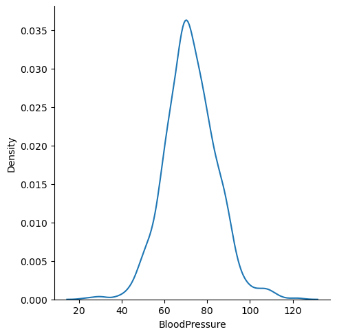
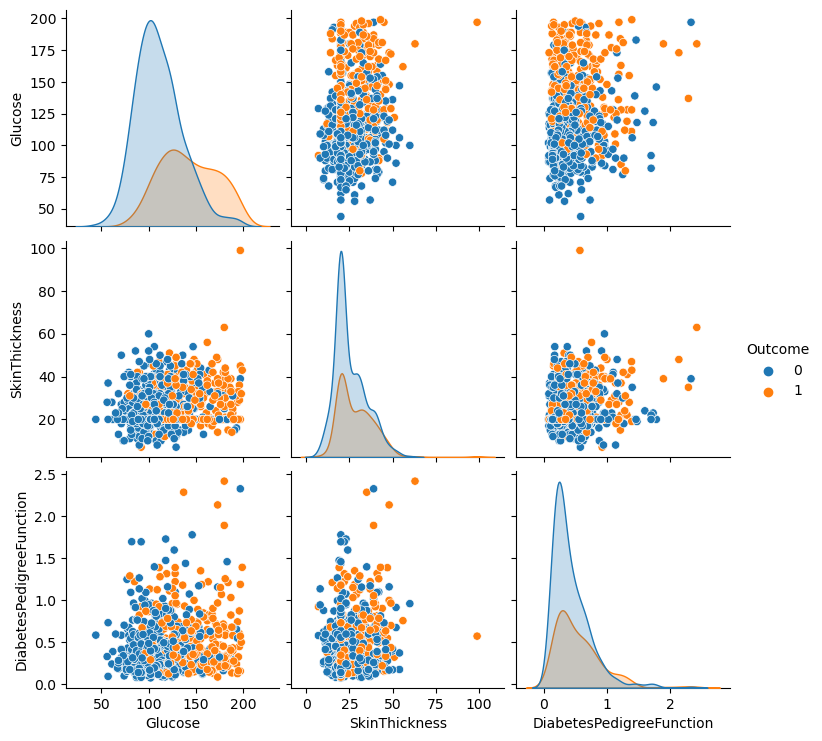
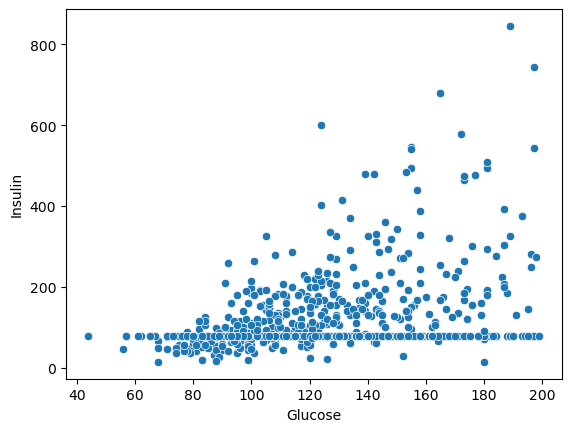
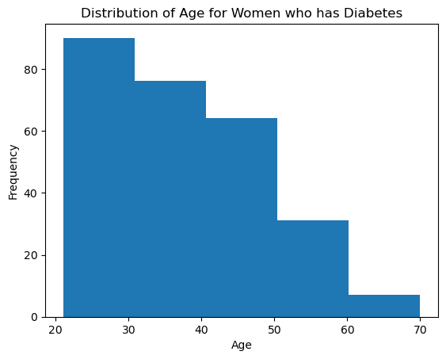
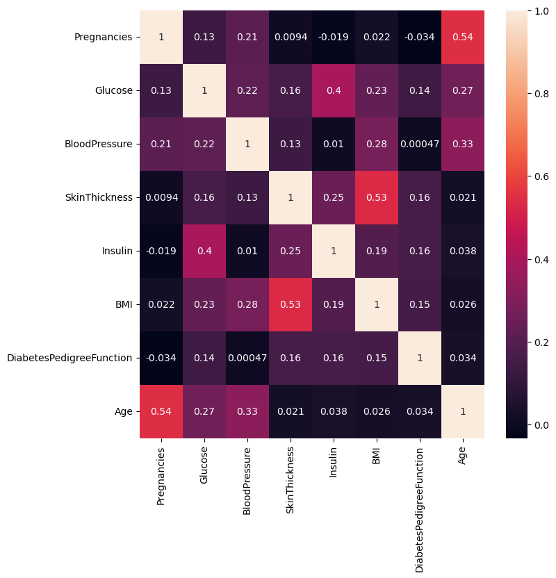

# Foundations of Data Science Project - Diabetes Analysis

---------------
## Context
---------------

Diabetes is one of the most frequent diseases worldwide and the number of diabetic patients are growing over the years. The main cause of diabetes remains unknown, yet scientists believe that both genetic factors and environmental lifestyle play a major role in diabetes.

A few years ago research was done on a tribe in America which is called the Pima tribe (also known as the Pima Indians). In this tribe, it was found that the ladies are prone to diabetes very early. Several constraints were placed on the selection of these instances from a larger database. In particular, all patients were females at least 21 years old of Pima Indian heritage. 

-----------------
## Objective
-----------------

Here, we are analyzing different aspects of Diabetes in the Pima Indians tribe by doing Exploratory Data Analysis.

-------------------------
## Data Dictionary
-------------------------

The dataset has the following information:

* Pregnancies: Number of times pregnant
* Glucose: Plasma glucose concentration over 2 hours in an oral glucose tolerance test
* BloodPressure: Diastolic blood pressure (mm Hg)
* SkinThickness: Triceps skin fold thickness (mm)
* Insulin: 2-Hour serum insulin (mu U/ml)
* BMI: Body mass index (weight in kg/(height in m)^2)
* DiabetesPedigreeFunction: A function that scores the likelihood of diabetes based on family history.
* Age: Age in years
* Outcome: Class variable (0: a person is not diabetic or 1: a person is diabetic)

## Q 1: Import the necessary libraries and briefly explain the use of each library (3 Marks)


```python
import numpy as np #imports numpy for numerical computing

import pandas as pd #imports pandas to work with dataframes

import seaborn as sns #imports seaborn for visualization

import matplotlib.pyplot as plt #imports matplotlib's pyplot library for visualization

%matplotlib inline #used to show matplotlib graphs in the notebook next to the code
```

#### Write your Answer here: 

Ans 1: Numpy is a package in Python that allows for scientific computing, for example by using objects called arrays. Pandas is another Python package that allows for data manipulation and analysis using objects called dataframes and series. Seaborn and Matplotlib are Python libraries that allow for data visualization and are useful for creating graphs and figures based on data.

## Q 2: Read the given dataset (2 Marks)


```python
pima = pd.read_csv("diabetes.csv")  #reads the csv file and stores it into a dataframe variable, pima
```

## Q3. Show the last 10 records of the dataset. How many columns are there? (2 Marks)


```python
pima.tail(10) #shows the last 10 rows of pima dataframe
```


<div>
<style scoped>
    .dataframe tbody tr th:only-of-type {
        vertical-align: middle;
    }

    .dataframe tbody tr th {
        vertical-align: top;
    }

    .dataframe thead th {
        text-align: right;
    }
</style>
<table border="1" class="dataframe">
  <thead>
    <tr style="text-align: right;">
      <th></th>
      <th>Pregnancies</th>
      <th>Glucose</th>
      <th>BloodPressure</th>
      <th>SkinThickness</th>
      <th>Insulin</th>
      <th>BMI</th>
      <th>DiabetesPedigreeFunction</th>
      <th>Age</th>
      <th>Outcome</th>
    </tr>
  </thead>
  <tbody>
    <tr>
      <th>758</th>
      <td>1</td>
      <td>106</td>
      <td>76</td>
      <td>20</td>
      <td>79</td>
      <td>37.5</td>
      <td>0.197</td>
      <td>26</td>
      <td>0</td>
    </tr>
    <tr>
      <th>759</th>
      <td>6</td>
      <td>190</td>
      <td>92</td>
      <td>20</td>
      <td>79</td>
      <td>35.5</td>
      <td>0.278</td>
      <td>66</td>
      <td>1</td>
    </tr>
    <tr>
      <th>760</th>
      <td>2</td>
      <td>88</td>
      <td>58</td>
      <td>26</td>
      <td>16</td>
      <td>28.4</td>
      <td>0.766</td>
      <td>22</td>
      <td>0</td>
    </tr>
    <tr>
      <th>761</th>
      <td>9</td>
      <td>170</td>
      <td>74</td>
      <td>31</td>
      <td>79</td>
      <td>44.0</td>
      <td>0.403</td>
      <td>43</td>
      <td>1</td>
    </tr>
    <tr>
      <th>762</th>
      <td>9</td>
      <td>89</td>
      <td>62</td>
      <td>20</td>
      <td>79</td>
      <td>22.5</td>
      <td>0.142</td>
      <td>33</td>
      <td>0</td>
    </tr>
    <tr>
      <th>763</th>
      <td>10</td>
      <td>101</td>
      <td>76</td>
      <td>48</td>
      <td>180</td>
      <td>32.9</td>
      <td>0.171</td>
      <td>63</td>
      <td>0</td>
    </tr>
    <tr>
      <th>764</th>
      <td>2</td>
      <td>122</td>
      <td>70</td>
      <td>27</td>
      <td>79</td>
      <td>36.8</td>
      <td>0.340</td>
      <td>27</td>
      <td>0</td>
    </tr>
    <tr>
      <th>765</th>
      <td>5</td>
      <td>121</td>
      <td>72</td>
      <td>23</td>
      <td>112</td>
      <td>26.2</td>
      <td>0.245</td>
      <td>30</td>
      <td>0</td>
    </tr>
    <tr>
      <th>766</th>
      <td>1</td>
      <td>126</td>
      <td>60</td>
      <td>20</td>
      <td>79</td>
      <td>30.1</td>
      <td>0.349</td>
      <td>47</td>
      <td>1</td>
    </tr>
    <tr>
      <th>767</th>
      <td>1</td>
      <td>93</td>
      <td>70</td>
      <td>31</td>
      <td>79</td>
      <td>30.4</td>
      <td>0.315</td>
      <td>23</td>
      <td>0</td>
    </tr>
  </tbody>
</table>
</div>


#### Write your Answer here: 


Ans 3: There are 9 columns in the diabetes.csv dataset

## Q4. Show the first 10 records of the dataset (2 Marks)


```python
pima.head(10) #shows the first 10 rows of the pima dataframe
```


<div>
<style scoped>
    .dataframe tbody tr th:only-of-type {
        vertical-align: middle;
    }

    .dataframe tbody tr th {
        vertical-align: top;
    }

    .dataframe thead th {
        text-align: right;
    }
</style>
<table border="1" class="dataframe">
  <thead>
    <tr style="text-align: right;">
      <th></th>
      <th>Pregnancies</th>
      <th>Glucose</th>
      <th>BloodPressure</th>
      <th>SkinThickness</th>
      <th>Insulin</th>
      <th>BMI</th>
      <th>DiabetesPedigreeFunction</th>
      <th>Age</th>
      <th>Outcome</th>
    </tr>
  </thead>
  <tbody>
    <tr>
      <th>0</th>
      <td>6</td>
      <td>148</td>
      <td>72</td>
      <td>35</td>
      <td>79</td>
      <td>33.600000</td>
      <td>0.627</td>
      <td>50</td>
      <td>1</td>
    </tr>
    <tr>
      <th>1</th>
      <td>1</td>
      <td>85</td>
      <td>66</td>
      <td>29</td>
      <td>79</td>
      <td>26.600000</td>
      <td>0.351</td>
      <td>31</td>
      <td>0</td>
    </tr>
    <tr>
      <th>2</th>
      <td>8</td>
      <td>183</td>
      <td>64</td>
      <td>20</td>
      <td>79</td>
      <td>23.300000</td>
      <td>0.672</td>
      <td>32</td>
      <td>1</td>
    </tr>
    <tr>
      <th>3</th>
      <td>1</td>
      <td>89</td>
      <td>66</td>
      <td>23</td>
      <td>94</td>
      <td>28.100000</td>
      <td>0.167</td>
      <td>21</td>
      <td>0</td>
    </tr>
    <tr>
      <th>4</th>
      <td>0</td>
      <td>137</td>
      <td>40</td>
      <td>35</td>
      <td>168</td>
      <td>43.100000</td>
      <td>2.288</td>
      <td>33</td>
      <td>1</td>
    </tr>
    <tr>
      <th>5</th>
      <td>5</td>
      <td>116</td>
      <td>74</td>
      <td>20</td>
      <td>79</td>
      <td>25.600000</td>
      <td>0.201</td>
      <td>30</td>
      <td>0</td>
    </tr>
    <tr>
      <th>6</th>
      <td>3</td>
      <td>78</td>
      <td>50</td>
      <td>32</td>
      <td>88</td>
      <td>31.000000</td>
      <td>0.248</td>
      <td>26</td>
      <td>1</td>
    </tr>
    <tr>
      <th>7</th>
      <td>10</td>
      <td>115</td>
      <td>69</td>
      <td>20</td>
      <td>79</td>
      <td>35.300000</td>
      <td>0.134</td>
      <td>29</td>
      <td>0</td>
    </tr>
    <tr>
      <th>8</th>
      <td>2</td>
      <td>197</td>
      <td>70</td>
      <td>45</td>
      <td>543</td>
      <td>30.500000</td>
      <td>0.158</td>
      <td>53</td>
      <td>1</td>
    </tr>
    <tr>
      <th>9</th>
      <td>8</td>
      <td>125</td>
      <td>96</td>
      <td>20</td>
      <td>79</td>
      <td>31.992578</td>
      <td>0.232</td>
      <td>54</td>
      <td>1</td>
    </tr>
  </tbody>
</table>
</div>


## Q5. What do you understand by the dimension of the dataset? Find the dimension of the `pima` dataframe. (3 Marks)


```python
pima.shape #shows the shape of the dataframe and outputs (rows, columns)
```


    (768, 9)


#### Write your Answer here: 


Ans 5: The dimension of the dataset is (768,9). That means that there are 768 rows and 9 columns in the dataset.

## Q6. What do you understand by the size of the dataset? Find the size of the `pima` dataframe. (3 Marks)


```python
pima.size #shows the size of the dataframe (rows * columns)
```


    6912


#### Write your Answer here: 


Ans 6: The size of the dataframe outputs 6912, which is the number of rows times the number of columns (768 * 9). This shows that is a large dataframe with many elements.

## Q7. What are the data types of all the variables in the data set? (2 Marks)
**Hint: Use the info() function to get all the information about the dataset.**


```python
pima.info() #method that shows the below information of the dataframe
```

    <class 'pandas.core.frame.DataFrame'>
    RangeIndex: 768 entries, 0 to 767
    Data columns (total 9 columns):
     #   Column                    Non-Null Count  Dtype  
    ---  ------                    --------------  -----  
     0   Pregnancies               768 non-null    int64  
     1   Glucose                   768 non-null    int64  
     2   BloodPressure             768 non-null    int64  
     3   SkinThickness             768 non-null    int64  
     4   Insulin                   768 non-null    int64  
     5   BMI                       768 non-null    float64
     6   DiabetesPedigreeFunction  768 non-null    float64
     7   Age                       768 non-null    int64  
     8   Outcome                   768 non-null    int64  
    dtypes: float64(2), int64(7)
    memory usage: 54.1 KB


#### Write your Answer here: 


Ans 7: The columns of the dataset contain all numerical variables. The following variable are the specific respective type:
- Pregancies is an int64 type variable. 
- Glucose is an int64 type variable. 
- BloodPressure is an int64 variable.
- SkinThickness is an int64 type variable.
- Insulin is an int64 type variable.
- BMI is a float64 type variable.
- DiabetesPedigreeFunction is a float64 type variable.
- Age is an int64 type variable.
- Outcome is an int64 type variable.

## Q8. What do we mean by missing values? Are there any missing values in the `pima` dataframe? (4 Marks)


```python
pima.isnull().values.any() #checks if there are any values in the pima dataframe that are missing. It returns a boolean.
#returns True if there are any missing values and False if there aren't.
```


    False


#### Write your Answer here: 


Ans 8: Missing values are values that are missing in the data set (not zeros but simply missing from the data). These are usually shown as NaN in the dataset or sometimes None or NA. There are no missing values in the pima dataframe.

## Q9. What do the summary statistics of the data represent? Find the summary statistics for all variables except 'Outcome' in the `pima` data. Take one column/variable from the output table and explain all its statistical measures. (5 Marks)


```python
pima.iloc[: , 0 : 8].describe() # pima.iloc[:,0:8] gets all the rows of the columns indexed from 0 to 8 
#(excludes the last column - Outcome). The .describe method describes the variables in the included columns
```


<div>
<style scoped>
    .dataframe tbody tr th:only-of-type {
        vertical-align: middle;
    }

    .dataframe tbody tr th {
        vertical-align: top;
    }

    .dataframe thead th {
        text-align: right;
    }
</style>
<table border="1" class="dataframe">
  <thead>
    <tr style="text-align: right;">
      <th></th>
      <th>Pregnancies</th>
      <th>Glucose</th>
      <th>BloodPressure</th>
      <th>SkinThickness</th>
      <th>Insulin</th>
      <th>BMI</th>
      <th>DiabetesPedigreeFunction</th>
      <th>Age</th>
    </tr>
  </thead>
  <tbody>
    <tr>
      <th>count</th>
      <td>768.000000</td>
      <td>768.000000</td>
      <td>768.000000</td>
      <td>768.000000</td>
      <td>768.000000</td>
      <td>768.000000</td>
      <td>768.000000</td>
      <td>768.000000</td>
    </tr>
    <tr>
      <th>mean</th>
      <td>3.845052</td>
      <td>121.675781</td>
      <td>72.250000</td>
      <td>26.447917</td>
      <td>118.270833</td>
      <td>32.450805</td>
      <td>0.471876</td>
      <td>33.240885</td>
    </tr>
    <tr>
      <th>std</th>
      <td>3.369578</td>
      <td>30.436252</td>
      <td>12.117203</td>
      <td>9.733872</td>
      <td>93.243829</td>
      <td>6.875374</td>
      <td>0.331329</td>
      <td>11.760232</td>
    </tr>
    <tr>
      <th>min</th>
      <td>0.000000</td>
      <td>44.000000</td>
      <td>24.000000</td>
      <td>7.000000</td>
      <td>14.000000</td>
      <td>18.200000</td>
      <td>0.078000</td>
      <td>21.000000</td>
    </tr>
    <tr>
      <th>25%</th>
      <td>1.000000</td>
      <td>99.750000</td>
      <td>64.000000</td>
      <td>20.000000</td>
      <td>79.000000</td>
      <td>27.500000</td>
      <td>0.243750</td>
      <td>24.000000</td>
    </tr>
    <tr>
      <th>50%</th>
      <td>3.000000</td>
      <td>117.000000</td>
      <td>72.000000</td>
      <td>23.000000</td>
      <td>79.000000</td>
      <td>32.000000</td>
      <td>0.372500</td>
      <td>29.000000</td>
    </tr>
    <tr>
      <th>75%</th>
      <td>6.000000</td>
      <td>140.250000</td>
      <td>80.000000</td>
      <td>32.000000</td>
      <td>127.250000</td>
      <td>36.600000</td>
      <td>0.626250</td>
      <td>41.000000</td>
    </tr>
    <tr>
      <th>max</th>
      <td>17.000000</td>
      <td>199.000000</td>
      <td>122.000000</td>
      <td>99.000000</td>
      <td>846.000000</td>
      <td>67.100000</td>
      <td>2.420000</td>
      <td>81.000000</td>
    </tr>
  </tbody>
</table>
</div>


#### Write your Answer here: 


Ans 9: The .describe() method describes the numeric and categorical variables in a dataframe. The summary statistics are helpful for seeing an overall view of each of the variable (columns) in the dataset. Looking at the Age column, the following rows and their descriptions are below:

1. The Count Row shows the number of non-empty values, in this case there are 768 non-empty values of "Age"

2. The Mean Row shows the average (mean) age of 33.24 years of the women in this dataset.

3. The Std Row shows the standard deviation of the women's age. In this case, the standard deviation is 11.76 which shows how dispersed the data is from the mean.

4. The Min Row shows the minimum value of Age. In this case its 21 years as no women under 21 were for part of this study.

5. The 25% Row shows the 25% Percentile of Age (24 Years). This is first quartile and it means 25% of the values of Age lie under this number (24).

6. The 50% Row shows the 50% Percentile, or the Median value, of Age (29 Years). This means that half the values of Age lie above and half the values lie below 29 years.

7. The 75% Row shows the 75% Percentile of Age (41 Years). This is third quartile and it means 75% of the values of Age lie under this number (41).

8. The Max Row shows the maximum value of Age. In this case its 81 years which is the oldest age of women that were part of the dataset.


## Q 10. Plot the distribution plot for the variable 'BloodPressure'. Write detailed observations from the plot. (2 Marks)


```python
sns.displot(pima['BloodPressure'], kind = 'kde') #plots the distribution of the Blood Pressure column values

plt.show() #shows the plot
```


    

    


#### Write your Answer here: 


Ans 10: The plot above shows the distribution plot, using the kernel density estimate of the Blood Pressure variable from the Pima Dataset. From the plot, we can see the majority of the Blood Pressure values in this dataset are around 70 mm Hg (which is normal diastolic blood pressure). However, there are some occurrences of high blood pressure (>80 mm Hg) and low blood pressure (<60 mm Hg) seen by the bumps around 30 and 110. 

## Q 11. What is the 'BMI' of the person having the highest 'Glucose'? (2 Marks)


```python
pima[pima['Glucose'] == pima['Glucose'].max()]['BMI'] #pima['Glucose'] == pima['Glucose'].max() shows the Glucose
#column with boolean results where True is listed at the max Glucose position. That result is sent to the pima
#dataframe again with the BMI column selected so that it outputs the index and the BMI of the row 
#where the max Glucose is present.
```


    661    42.9
    Name: BMI, dtype: float64


#### Write your Answer here: 


Ans 11: The BMI of the person having the highest Glucose is 42.9 (weight in kg/(height in m)^2).

## Q12.
### 12.1 What is the mean of the variable 'BMI'? 
### 12.2 What is the median of the variable 'BMI'? 
### 12.3 What is the mode of the variable 'BMI'?
### 12.4 Are the three measures of central tendency equal?

### (4 Marks)


```python
m1 = pima['BMI'].mean()  # mean
print(m1)

m2 = pima['BMI'].median()  # median
print(m2)

m3 = pima['BMI'].mode()[0] # mode
print(m3)
```

    32.45080515543617
    32.0
    32.0


#### Write your Answer here: 


Ans 12: All three measures of central tendency are not equal. However, the median and mode are equal (both 32.0) and the mean is only a little higher than both (32.45). This shows that the BMI of all the women in the dataset is symmetrically distributed and does not show skewness. 

## Q13. How many women's 'Glucose' levels are above the mean level of 'Glucose'? (2 Marks)


```python
pima[pima['Glucose'] > pima['Glucose'].mean()].shape[0] #pima['Glucose'] > pima['Glucose'].mean() shows the Glucose 
#column with Boolean results where True is listed at any value that is greater than the mean of the entire Glucose 
#column. That result is passed into the pima dataframe to get all the rows where the above function is true. The
#shape of the corresponding dataframe is accessed, specifically at index 0 which ouputs the number of rows.
```


    343


#### Write your Answer here: 


Ans 13: There are 343 women whose Glucose levels are above the mean level of the overall Glucose column.

## Q14. How many women have their 'BloodPressure' equal to the median of 'BloodPressure' and their 'BMI' less than the median of 'BMI'? (2 Marks)


```python
pima[(pima['BloodPressure'] == pima['BloodPressure'].median()) & (pima['BMI'] < pima['BMI'].median())].shape[0]
#pima['BloodPressure'] == pima['BloodPressure'].median() outputs a column with Boolean result where True is listed
#at any value of Blood Pressure that is equal to the median of the Blood Pressure column. 
#pima['BMI'] < pima['BMI'].median() outputs a column with Boolean result where True is listed
#at any value of BMI that is less than the median of the BMI column.
#Both those functions are joined with a conditional "and" and used to call the pima dataframe where rows are outputted
#when both those functions return True. 
#The shape of the corresponding dataframe is called, at index 0 which outputs the number of rows.
```


    22


#### Write your Answer here: 


Ans 14: There are 22 women who have their Blood Pressure equal to the median of Blood Pressure and their BMI less than the median of BMI.

## Q15. Create a pairplot for the variables 'Glucose', 'SkinThickness', and 'DiabetesPedigreeFunction'. Write your observations from the plot. (3 Marks)


```python
sns.pairplot(data = pima, vars = ['Glucose', 'SkinThickness', 'DiabetesPedigreeFunction'], hue = 'Outcome')
plt.show() #shows the pairplot
```


    

    


#### Write your Answer here: 


Ans 15: Using these pair plots, the relationship between the three variables is shown and how it affects the outcome (if a person has diabetes or not):

Overall, the plots show that diabetic women usually have a higher glucose level. Skin thickness is mostly distributed around ~23-24mm for both non-diabetic and diabetic women. The Diabetes Pedigree Function is mostly distributed around ~0.3 for both non-diabetic and diabetic women.

- Between the plots showing the Glucose vs. Diabetes Pedigree Function and Glucose vs. Skin Thickness, a higher Glucose level for both the other variables shows it is more likely that a woman is diabetic.
- Skin Thickness vs. Diabetes Pedigree Function doesn't show a strong trend.

## Q16. Plot the scatterplot between 'Glucose' and 'Insulin'. Write your observations from the plot. (4 Marks)


```python
sns.scatterplot(x = 'Glucose', y = 'Insulin', data = pima)
plt.show() #shows the scatterplot of Glucose vs Insulin
```


    

    


#### Write your Answer here: 


Ans 16: The scatterplot shows that there is a trend between Glucose and Insulin levels. High glucose levels correspond to a higher insulin measurement.

## Q 17. Plot the boxplot for the 'Age' variable. Are there outliers? (2 Marks)


```python
plt.boxplot(pima['Age']) #shows the boxplot of the Age data

plt.title('Boxplot of Age')
plt.ylabel('Age')
plt.show()
```


    

    


#### Write your Answer here: 


Ans 17: There are outliers in the Age data of the pima dataset. They can be seen by the circles outside of the whiskers of the box plot.

## Q18. Plot histograms for the 'Age' variable to understand the number of women in different age groups given whether they have diabetes or not. Explain both histograms and compare them. (5 Marks)


```python
#plots the count of each Age of when Outcome = 1 (They have diabetes)
plt.hist(pima[pima['Outcome'] == 1]['Age'], bins = 5) 
plt.title('Distribution of Age for Women who has Diabetes')
plt.xlabel('Age')
plt.ylabel('Frequency')
plt.show()
```


    

    


```python
#plots the count of each Age of when Outcome = 0 (They don't have diabetes)
plt.hist(pima[pima['Outcome'] == 0]['Age'], bins = 5)
plt.title('Distribution of Age for Women who do not have Diabetes')
plt.xlabel('Age')
plt.ylabel('Frequency')
plt.show()
```


    

    


#### Write your Answer here: 


Ans 18: The graph of the women who do not have diabetes is positively (right) skewed, showing that overall, more younger women do not have diabetes. It can be seen that many women who do not have diabetes are in the 20-30 age bin. 

Meanwhile, in the graph for the distribution of women who have diabetes, the 20-30 age bin has the highest count compared to the other bins but ages 30-50 still have similarly high counts of diabetes. 

Overall, more women in the dataset do not have diabetes as seen from the fact that the highest frequency in the second graph (women who don't have diabetes) is a little under 350, while the highest frequency in the first graph (women who have diabetes) is above 80.

## Q 19. What is the Interquartile Range of all the variables? Why is this used? Which plot visualizes the same? (5 Marks)


```python
Q1 = pima.quantile(0.25) #calculates the 25th percentile value, value below which 25% of the data lies
Q3 = pima.quantile(0.75) #calculates the 75th percentile value, value below which 75% of the data lies
IQR = Q3 - Q1 #formula for calculating the interquartile range
print(IQR)
```

    Pregnancies                  5.0000
    Glucose                     40.5000
    BloodPressure               16.0000
    SkinThickness               12.0000
    Insulin                     48.2500
    BMI                          9.1000
    DiabetesPedigreeFunction     0.3825
    Age                         17.0000
    Outcome                      1.0000
    dtype: float64


#### Write your Answer here: 


Ans 19: The interquartile range for all variables is shown below:
- Pregancies: 5
- Glucose: 40.5
- Blood Pressure: 16
- Skin Thickness: 12
- Insulin: 48.25
- BMI: 9.1
- Diabetes Pedigree Function: 0.3825
- Age: 17
- Outcome: 1

The Interquartile Range (IQR) shows the spread of the middle half of the data (while the range gives you the spread of the entire data). The IQR is useful for showing the skewness of the data when used with the Median. The IQR is also useful if the dataset contains outliers because since it shows the middle values of the data, it might be less influenced by extreme values. A boxplot can be used to visualize the IQR.

## Q 20. Find and visualize the correlation matrix. Write your observations from the plot. (3 Marks)


```python
corr_matrix = pima.iloc[ : ,0 : 8].corr() #calculates the correlation of the the columns except for "Outcome"

corr_matrix #outputs the correlation matrix
```


<div>
<style scoped>
    .dataframe tbody tr th:only-of-type {
        vertical-align: middle;
    }

    .dataframe tbody tr th {
        vertical-align: top;
    }

    .dataframe thead th {
        text-align: right;
    }
</style>
<table border="1" class="dataframe">
  <thead>
    <tr style="text-align: right;">
      <th></th>
      <th>Pregnancies</th>
      <th>Glucose</th>
      <th>BloodPressure</th>
      <th>SkinThickness</th>
      <th>Insulin</th>
      <th>BMI</th>
      <th>DiabetesPedigreeFunction</th>
      <th>Age</th>
    </tr>
  </thead>
  <tbody>
    <tr>
      <th>Pregnancies</th>
      <td>1.000000</td>
      <td>0.128022</td>
      <td>0.208987</td>
      <td>0.009393</td>
      <td>-0.018780</td>
      <td>0.021546</td>
      <td>-0.033523</td>
      <td>0.544341</td>
    </tr>
    <tr>
      <th>Glucose</th>
      <td>0.128022</td>
      <td>1.000000</td>
      <td>0.219765</td>
      <td>0.158060</td>
      <td>0.396137</td>
      <td>0.231464</td>
      <td>0.137158</td>
      <td>0.266673</td>
    </tr>
    <tr>
      <th>BloodPressure</th>
      <td>0.208987</td>
      <td>0.219765</td>
      <td>1.000000</td>
      <td>0.130403</td>
      <td>0.010492</td>
      <td>0.281222</td>
      <td>0.000471</td>
      <td>0.326791</td>
    </tr>
    <tr>
      <th>SkinThickness</th>
      <td>0.009393</td>
      <td>0.158060</td>
      <td>0.130403</td>
      <td>1.000000</td>
      <td>0.245410</td>
      <td>0.532552</td>
      <td>0.157196</td>
      <td>0.020582</td>
    </tr>
    <tr>
      <th>Insulin</th>
      <td>-0.018780</td>
      <td>0.396137</td>
      <td>0.010492</td>
      <td>0.245410</td>
      <td>1.000000</td>
      <td>0.189919</td>
      <td>0.158243</td>
      <td>0.037676</td>
    </tr>
    <tr>
      <th>BMI</th>
      <td>0.021546</td>
      <td>0.231464</td>
      <td>0.281222</td>
      <td>0.532552</td>
      <td>0.189919</td>
      <td>1.000000</td>
      <td>0.153508</td>
      <td>0.025748</td>
    </tr>
    <tr>
      <th>DiabetesPedigreeFunction</th>
      <td>-0.033523</td>
      <td>0.137158</td>
      <td>0.000471</td>
      <td>0.157196</td>
      <td>0.158243</td>
      <td>0.153508</td>
      <td>1.000000</td>
      <td>0.033561</td>
    </tr>
    <tr>
      <th>Age</th>
      <td>0.544341</td>
      <td>0.266673</td>
      <td>0.326791</td>
      <td>0.020582</td>
      <td>0.037676</td>
      <td>0.025748</td>
      <td>0.033561</td>
      <td>1.000000</td>
    </tr>
  </tbody>
</table>
</div>


```python
plt.figure(figsize = (8, 8))
sns.heatmap(corr_matrix, annot = True) #plot the heatmap which shows the correlation between 
#variables on each axis in a square

# Display the plot
plt.show()
```


    

    


#### Write your Answer here: 


Ans 20: On the above heatmap, lighter colors show a strong positive correlation while darker colors do not show any correlation. Based on the above, out of all the variables, the most strongly correlated variables are Age and Pregnancies (correlation value of 0.54) and BMI and Skin Thickness (correlation value of 0.53). Insulin and Glucose also show a slight positive correlation with a correlation value of 0.4.

Most of the other variables do not show any strong correlation. Some variables do show a negative correlation, such as Insulin and Pregnancies but it is very close to 0 so it does not show correlation.
